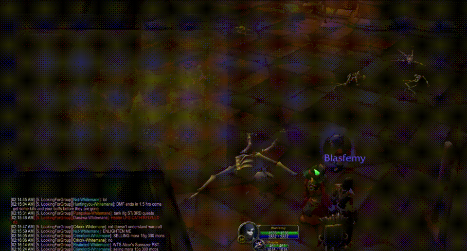
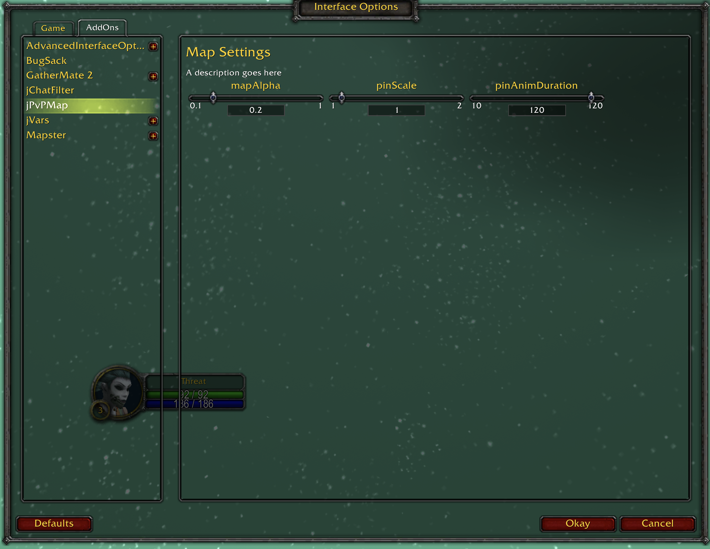

# jPvPMap
## Warcraft PvP Map mod, since 2019

## License

## Why
- Because searching for your tiny dot on the map takes forever
- ...and on a PvP server, it's helpful to see behind your map

## How
Interface > Addons UI

## Platforms
UI works with Classic Era, Classic Wrath and Retail

## FAQ

## Issues
https://github.com/jadissa/jPvPMap/issues

## Screenshots

  
  

